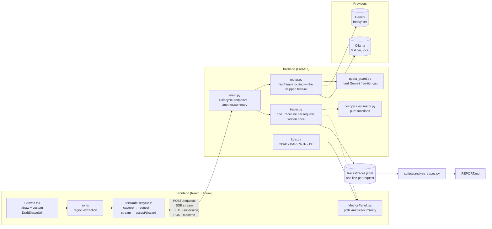

# Project SLATE

An infinite ink canvas (React + tldraw) where drawing or writing in a
region triggers an inline AI draft — completions, answers, corrections —
rendered directly on the canvas as a first-class object with its own
lifecycle (`pending → streaming → ready → accepted | discarded`).

## Quickstart

**Backend**

```bash
cd backend
pip install -r requirements.txt --break-system-packages   # or use a venv
cp .env.example .env        # fill in GEMINI_API_KEY, or run Ollama locally
uvicorn main:app --reload --port 8000
```

Needs at least one real provider to actually generate drafts:
- **Gemini:** set `GEMINI_API_KEY` in `.env` (currently targeting `gemini-3.6-flash` — verify this is still current before relying on it, model availability shifts fast)
- **Ollama (local):** `ollama pull qwen3-vl:4b-instruct` and have Ollama running on `localhost:11434`

Verify it's up: `curl http://localhost:8000/health`

**Frontend**

```bash
cd frontend
npm install
cp .env.example .env.local   # only needed if your backend isn't on :8000
npm run dev
```

Open the printed localhost URL. Draw something; a draft shape appears
after the idle timer (~1s), or immediately via **Generate now**
(`Ctrl/⌘+Enter`).

**Tests**

```bash
# from repo root
pip install -r backend/requirements.txt --break-system-packages
pytest   # 71 tests: cost, KPIs, estimator/MAE, trace schema, router geometry, quota guard, think-filter
```

## Architecture



```
backend/
  main.py             4 lifecycle endpoints + 1 read-only metrics endpoint
  models.py            Pydantic schema — TraceLine, TokenUsage, LatencySegments (6 segments + e2e)
  kpis.py                CPAD / DAR / WTR / BC — the four required derived KPIs
  router.py                the shipped feature: threshold-based model routing
  quota_guard.py              hard, tested safety cap on Gemini free-tier usage
  think_filter.py               strips <think> tags some models emit as literal text
  estimator.py                    image token estimator + MAE validation
  cost.py                           pure token+rate -> $ function (brief's exact formula)
  tracer.py                          buffers a trace per request_id, writes JSONL once complete
  adapters/client.py                   one adapter, three provider configs
  config/rates.yaml                      never-hard-coded pricing

frontend/src/
  components/canvas/    tldraw wrapper, custom DraftShapeUtil, ROI extraction, Markdown+LaTeX rendering
  components/panel/       live metrics panel — requests, KPIs, cost (polls GET /metrics/summary)
  components/layout/       top bar (save/load/export, generate-now)
  hooks/useDraftLifecycle.ts   orchestrates capture -> request -> stream -> accept/discard, e2e timing
  lib/                          api client + types mirroring backend/models.py

scripts/
  analyze_traces.py           the only path from traces/*.jsonl to REPORT.md
  run_experiment.py             B5 harness: pins provider+config_id per arm, interleaves requests
  validate_image_token_estimator.py   one-off ground-truth validation against Gemini's native SDK
  frame_timing_stress_test.js           paste into DevTools console — see "Interaction latency" below
```

### Backend endpoint count

The backend surface is deliberately 4 endpoints for the request lifecycle
(`POST /requests`, `GET /requests/{id}/stream`, `DELETE /requests/{id}`,
`POST /requests/{id}/outcome`). A 5th, `GET /metrics/summary`, exists
purely to feed the live metrics panel with read-only aggregate stats and
the four KPIs.

## Declared latency budget (for BC — Budget Compliance)

**p95 e2e ≤ 8000ms.** This is the number `kpis.py`'s `DEFAULT_LATENCY_BUDGET_MS`
is set to — that constant is the single source of truth; this line
should always match it, not the other way around. Chosen as a
starting point for a multimodal call through a free-tier cloud provider
or a small local model on consumer hardware; revisit once real B5 data
shows where the actual distribution sits.

## Interaction latency (5,000+ strokes)

`scripts/frame_timing_stress_test.js` — paste into DevTools console while
running `npm run dev` (not a production build). It creates 5,000 draw
shapes and measures real frame timing while panning for 3 seconds.

**Measured result: _pending — run the script and paste the real p50/p95/mean
numbers here before submission. Do not estimate or skip this — it's an
explicit, checked requirement, not optional polish._**

## Keyboard shortcuts

| Action | Shortcut | Discoverable via |
|---|---|---|
| Generate now (skip idle timer) | `Ctrl/⌘ + Enter` | Hint shown directly on the button in the top bar |
| Toggle metrics panel | `Ctrl/⌘ + M` | Hint in the panel toggle button's tooltip |
| Accept the current ready draft | `Enter` | Hint shown directly on the Accept button |
| Discard the current ready draft | `Escape` | Hint shown directly on the Discard button |
| Undo / redo / delete / tool switching | tldraw defaults | tldraw's own toolbar and standard shortcuts |

## Running the B5 experiment

```bash
# with real benchmark canvases (crops exported from the Five Canvases — see below):
python scripts/run_experiment.py --crops-dir traces/benchmark_crops/ --arms gemini,ollama --requests-per-arm 45

# or to exercise the harness before real canvases exist:
python scripts/run_experiment.py --synthetic 5 --arms gemini,ollama --requests-per-arm 10

python scripts/analyze_traces.py --traces backend/traces/traces.jsonl --out reports/
```

`scripts/analyze_traces.py` is the only code path that produces numbers
for `reports/REPORT.md` — every figure there traces back to this script,
not to hand-typing. It groups by `config_id` (set per-arm by
`run_experiment.py`), reports p50/p95 e2e, mean tokens, mean cost, and
DAR per arm, plus the four session-wide KPIs.

### The Five Canvases

Per the brief: five saved canvas files, reused for every experiment run,
committed to the repo at `traces/five_canvases/*.json` (via the app's own
Save button), with matching exported crops at `traces/benchmark_crops/*.png`
(via Export PNG) for the harness to actually send:

1. A handwritten multi-line equation
2. A rough boxes-and-arrows system sketch
3. A handwritten plain-language question
4. A dense canvas — 300+ strokes, mixed content
5. A deliberately ambiguous or half-erased scrawl

**Status: not yet created — this is real handwritten/sketched content
that has to be produced by hand, not generated.**

## Trade-offs & Scope Decisions

Everything below was a deliberate call, not something skipped for lack of
time. Stated here rather than left to be discovered.

**Canvas engine: tldraw, not a custom scene graph.**
Metrics + Experiment + the shipped feature carry more combined weight than
the canvas section (37 of 100 vs. 25). Rebuilding pan/zoom/undo/selection
that a mature SDK already solves correctly would have spent days on the
lower-weighted section for marginal gain — that time went into the
metrics layer instead, per the brief's own stated FAQ answer on this
exact trade-off.

**No accounts, auth, or server-side persistence.**
Both are out of scope by design. Canvas save/load (`persistence.ts`) is a
pure client-side JSON blob operation.

**No fine-tuning, no custom OCR/handwriting model.**
A modern multimodal model already reads handwriting; the system around it
— context extraction, routing, measurement — is what this project is
actually testing.

**SSE, not WebSockets.**
The request lifecycle needs one direction of continuous streaming (model
tokens) and one client-to-server signal (cancel/supersede). WebSockets
would add full duplex connection-state management for a channel direction
that's never actually used.

**No Docker, cloud deployment, or CI/CD.**
Out of scope by the brief's own list.

**One shipped feature, not several.**
Model routing (`router.py`) was selected from 9 scored candidates in
`IDEAS.md` — see that file for the full per-idea `why_canvas` reasoning
and what got cut.

**Backend surface kept to 4 (+1 read-only) endpoints.**
No services/repositories/controllers layering — this is a single-team,
single-user tool where clean and readable beats enterprise-shaped.

**OpenRouter available but kept out of the core B5 experiment.**
Included in `adapters/client.py` for cross-provider access, but excluded
from the graded arms — it sits between the client and the underlying
model, so its latency/token numbers can't be independently verified as
reflecting the provider rather than the broker's own overhead.

**Cost formula follows the brief's exact literal formula**, not a
finer-grained one: `(in × rate_in + out × rate_out + reasoning × rate_out) / 1e6`,
where "in" is combined text+image tokens at one input rate. See
`cost.py`'s docstring.

## Known gaps as of this commit

Documented here rather than discovered later — see `AI_USAGE.md` for the
full verification log:

- **Interaction frame timing**: script built and verified against real
  tldraw APIs, but not yet run — needs a real browser session, see above
- **The Five Canvases**: don't exist yet — this is real handwritten
  content that has to be produced by hand
- **B5 experiment**: not yet run for real; harness is built and
  synthetic-mode-tested
- **Two required before/after optimizations**: not yet implemented or measured
- **Token estimator MAE validation** (`scripts/validate_image_token_estimator.py`):
  built and bug-fixed, but not yet run against real Gemini calls — pending
  quota availability
- **`ATTRIBUTION.md`**: currently a template — needs an actual review
  pass of PenEcho before the borrowed-ideas table can be honestly filled in
- **Rate table** (`config/rates.yaml`) has placeholder Gemini prices —
  not yet verified against Google's live pricing page
- **Pointer pressure/tilt**: relies entirely on tldraw's own default
  handling; not independently verified against real pressure-sensitive
  hardware (no stylus available for testing — the brief explicitly says
  this is fine to note rather than fake)
