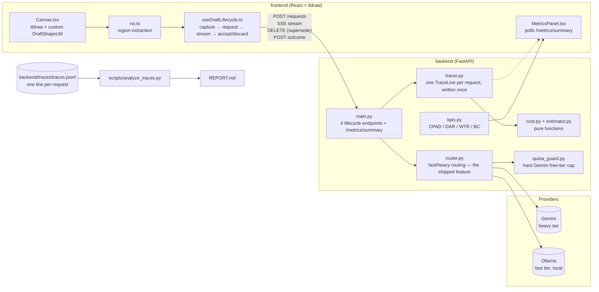
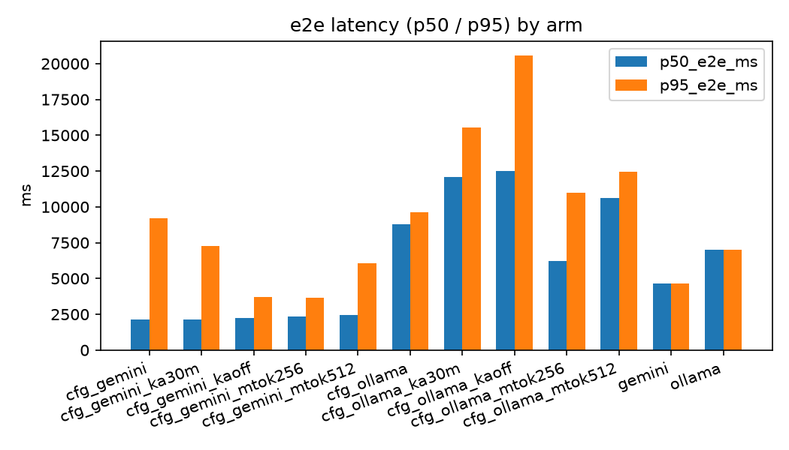
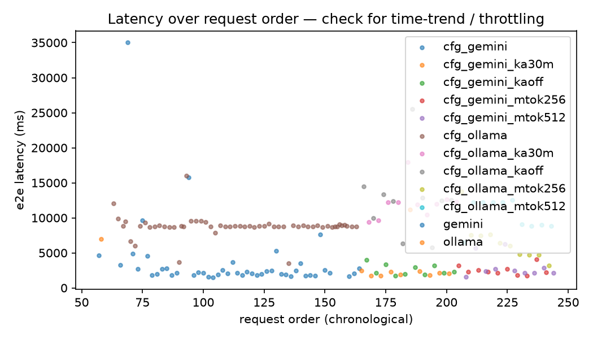

# Project SLATE

Project SLATE is an infinite ink canvas built with React, tldraw, and FastAPI where drawing or writing in a region triggers an inline multimodal AI draft. Drafts stream directly onto the canvas as first-class objects with a clear lifecycle (`pending → streaming → ready → accepted | discarded`). The system also includes threshold-based model routing, request tracing, live metrics, cost estimation, quota protection, and a reproducible experiment harness for comparing Gemini and local Ollama inference.

## Quickstart

### 1. Clone

```bash
git clone git@github.com:Siddhuuuu/SLATE.git && cd SLATE
````

### 2. Backend + API key

```bash
cd backend && python3 -m venv .venv && source .venv/bin/activate && pip install -r requirements.txt && cp .env.example .env && nano .env && uvicorn main:app --reload --port 8000
```

Put in `.env`:

```env
MODEL_PROVIDER=gemini
GEMINI_API_KEY=YOUR_KEY
GEMINI_MODEL=gemini-3.5-flash-lite
```

### 3. Frontend

**New terminal:**

```bash
cd SLATE/frontend && npm install && npm run dev
```

Open the localhost URL printed by Vite. Draw or write on the canvas; after the idle trigger, SLATE generates an inline AI draft. **Generate now** is also available with `Ctrl/⌘ + Enter`.

## Architecture



The backend exposes four request-lifecycle endpoints — `POST /requests`, `GET /requests/{id}/stream`, `DELETE /requests/{id}`, and `POST /requests/{id}/outcome` — plus the read-only `GET /metrics/summary` endpoint used by the live metrics panel.

## Experimental Results

The final controlled experiments used the same benchmark crops and interleaved requests across Gemini and Ollama. Two optimization variables were tested independently:

* **Keep-alive:** `30m` vs `off`
* **Maximum output tokens:** `256` vs `512`

Each condition received 10 requests. Results were generated directly from the recorded traces by `scripts/analyze_traces.py`.

### Controlled experiment results

| config_id          |  n | n_with_e2e |  DAR | p50 e2e (ms) | p95 e2e (ms) | max e2e (ms) | mean total tokens | mean cost (USD) | total cost (USD) |
| ------------------ | -: | ---------: | ---: | -----------: | -----------: | -----------: | ----------------: | --------------: | ---------------: |
| cfg_gemini_ka30m   | 10 |         10 | 100% |     2113.927 |     7259.260 |    11205.130 |            1195.4 |               0 |                0 |
| cfg_gemini_kaoff   | 10 |         10 | 100% |     2214.203 |     3700.145 |     3983.813 |            1204.5 |               0 |                0 |
| cfg_gemini_mtok256 | 10 |         10 | 100% |     2331.041 |     3653.198 |     4036.440 |            1169.6 |               0 |                0 |
| cfg_gemini_mtok512 | 10 |         10 | 100% |     2447.037 |     6038.337 |     6292.430 |            1175.4 |               0 |                0 |
| cfg_ollama_ka30m   | 10 |         10 | 100% |    12108.916 |    15539.149 |    17940.164 |            1620.1 |               0 |                0 |
| cfg_ollama_kaoff   | 10 |         10 | 100% |    12516.173 |    20560.128 |    25559.681 |            1570.7 |               0 |                0 |
| cfg_ollama_mtok256 | 10 |         10 | 100% |     6208.605 |    10983.429 |    13724.808 |            1362.3 |               0 |                0 |
| cfg_ollama_mtok512 | 10 |         10 | 100% |    10642.239 |    12431.485 |    12578.524 |            1596.5 |               0 |                0 |

Cost note: All Gemini experiment requests were run using the Gemini API free tier, so the recorded experiment cost is $0; for reference, Gemini 3.5 Flash-Lite is currently priced at $0.30 per 1M input tokens and $2.50 per 1M output tokens on the paid tier.

### Session KPIs

| KPI      |        Result | Meaning                                      |
| -------- | ------------: | -------------------------------------------- |
| **CPAD** | **$0.000003** | Cost per accepted draft                      |
| **DAR**  |    **96.12%** | Draft acceptance rate                        |
| **WTR**  |     **8.59%** | Wasted token ratio                           |
| **BC**   |    **54.64%** | Requests meeting the 8,000 ms latency budget |

The declared interactive latency budget is **8,000 ms p95 E2E**.

### What the results show

**Gemini was substantially faster in the controlled experiment.** With a 256-token output cap, Gemini achieved a **2.33 s p50** and **3.65 s p95**, compared with **6.21 s p50** and **10.98 s p95** for Ollama.

**The strongest measured optimization was reducing Ollama's maximum output from 512 to 256 tokens.** Median latency decreased from **10.64 s to 6.21 s**, approximately a **41.7% reduction**.

**Keep-alive helped Ollama's tail latency.** Its p95 decreased from **20.56 s with keep-alive off to 15.54 s with a 30-minute keep-alive**, approximately a **24.4% reduction**. The effect was not universal: Gemini's keep-alive comparison did not improve p95, so the optimization is provider/runtime dependent.

**The 256-token Gemini condition was also faster than its 512-token counterpart**, with p50 decreasing from **2.45 s to 2.33 s** and p95 decreasing from **6.04 s to 3.65 s**.

### Interpreting the trace history

The repository contains **245 accumulated traces**. These include earlier exploratory runs as well as the final controlled experiments above. The controlled 10-request conditions are the primary basis for the optimization conclusions.

Two historical Gemini traces timed out at the application's 45-second request budget, and earlier experiment attempts encountered Gemini API rate limits while the local quota guard was configured with conservative safety limits. These traces were retained rather than silently removed.

`n_with_e2e` indicates how many traces contain a usable end-to-end latency measurement. This is why historical groups can have fewer E2E observations than total traces.

Gemini's controlled traces do not contain populated per-request `cost_usd` values, so Gemini cost is shown as `—` rather than being incorrectly reported as free. Ollama was executed locally and recorded **$0 provider/API cost**; this does not imply zero local compute or energy cost.

## Results Visualizations

### Latency




### Time trend



### Interaction latency

A browser stress test was run against the development build using the
tldraw canvas with 4,000 rendered draw shapes while continuously panning
for 3 seconds.

| Metric | Measured |
|---|---:|
| p50 frame time | 6.90 ms |
| p95 frame time | 10.20 ms |
| Mean frame time | 6.90 ms |
| p50 FPS | 144.9 |
| p95 FPS | 98.0 |
| Mean FPS | 143.2 |

The test collected 430 frame samples. The current tldraw page limit is
4,000 shapes, so this run does not claim a 5,000-shape workload.
