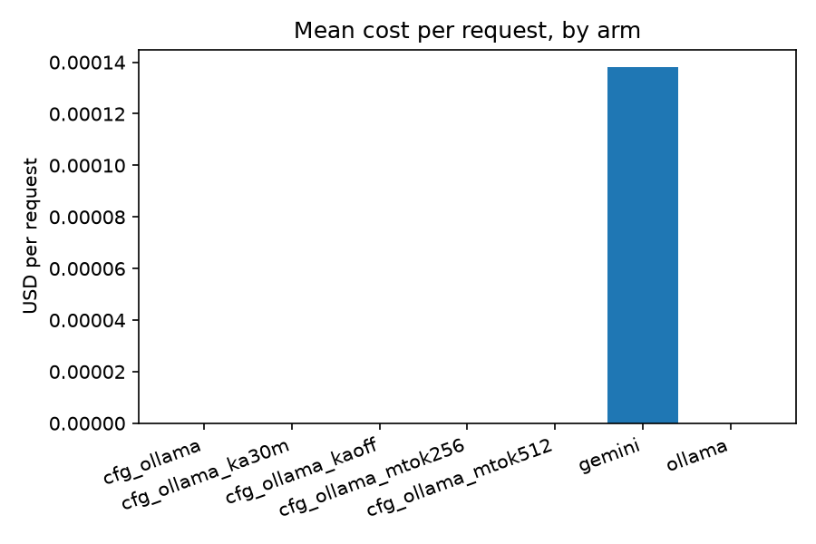

# REPORT.md

_Generated by `scripts/analyze_traces.py` from 245 traces. Every number below traces back to this script — none are hand-typed._

## Session-wide KPIs

| KPI | Value | Definition |
|---|---|---|
| CPAD | $0.0000 | Cost per Accepted Draft |
| DAR | 96.1% | Draft Acceptance Rate |
| WTR | 8.6% | Wasted Token Ratio |
| BC | 54.6% | Budget Compliance (p95 e2e ≤ 8000ms) |

## Per-arm summary (grouped by config_id)

| config_id          |   n |   n_with_e2e |   dar |   p50_e2e_ms |   p95_e2e_ms |   max_e2e_ms |   mean_total_tokens |   mean_cost_usd |   total_cost_usd |
|:-------------------|----:|-------------:|------:|-------------:|-------------:|-------------:|--------------------:|----------------:|-----------------:|
| cfg_gemini         |  47 |           45 | 1.000 |     2145.726 |     9209.981 |    35015.566 |            1140.681 |         -     |            0.000 |
| cfg_gemini_ka30m   |  10 |           10 | 1.000 |     2113.927 |     7259.260 |    11205.130 |            1195.400 |         -     |            0.000 |
| cfg_gemini_kaoff   |  10 |           10 | 1.000 |     2214.203 |     3700.145 |     3983.813 |            1204.500 |         -     |            0.000 |
| cfg_gemini_mtok256 |  10 |           10 | 1.000 |     2331.041 |     3653.198 |     4036.440 |            1169.600 |         -     |            0.000 |
| cfg_gemini_mtok512 |  10 |           10 | 1.000 |     2447.037 |     6038.337 |     6292.430 |            1175.400 |         -     |            0.000 |
| cfg_ollama         |  56 |           56 | 1.000 |     8794.607 |     9629.191 |    15981.210 |            1653.232 |           0.000 |            0.000 |
| cfg_ollama_ka30m   |  10 |           10 | 1.000 |    12108.916 |    15539.149 |    17940.164 |            1620.100 |           0.000 |            0.000 |
| cfg_ollama_kaoff   |  10 |           10 | 1.000 |    12516.173 |    20560.128 |    25559.681 |            1570.700 |           0.000 |            0.000 |
| cfg_ollama_mtok256 |  10 |           10 | 1.000 |     6208.605 |    10983.429 |    13724.808 |            1362.300 |           0.000 |            0.000 |
| cfg_ollama_mtok512 |  10 |           10 | 1.000 |    10642.239 |    12431.485 |    12578.524 |            1596.500 |           0.000 |            0.000 |
| gemini             |  29 |            1 | 0.714 |     4651.900 |     4651.900 |     4651.900 |            1331.273 |           0.000 |            0.001 |
| ollama             |  33 |            1 | 0.667 |     6997.400 |     6997.400 |     6997.400 |            1794.043 |           0.000 |            0.000 |

## Charts

## Protocol

The experiment evaluated multimodal inference latency and efficiency across two providers: **Gemini 3.5 Flash-Lite** (`gemini-3.5-flash-lite`) and **Ollama** (`qwen3-vl:4b-instruct`). The same five benchmark image crops were reused across the experiments to keep the visual workload consistent. Each controlled condition used **10 requests per arm**, with requests **interleaved** rather than running one provider completely before the other.

Two controlled optimization experiments were performed:

1. **Keep-alive comparison:** Gemini and Ollama were each tested with keep-alive enabled for 30 minutes and with keep-alive disabled, producing four conditions:
   - `cfg_gemini_ka30m`
   - `cfg_gemini_kaoff`
   - `cfg_ollama_ka30m`
   - `cfg_ollama_kaoff`

2. **Maximum-output-token comparison:** Gemini and Ollama were each tested with maximum output limits of 256 and 512 tokens, producing four conditions:
   - `cfg_gemini_mtok256`
   - `cfg_gemini_mtok512`
   - `cfg_ollama_mtok256`
   - `cfg_ollama_mtok512`

The experiment harness pinned the provider for each arm and interleaved requests so that the comparison was not affected by automatic model routing. A 15-second cooldown was used between requests. All results were generated from the recorded traces using `scripts/analyze_traces.py`.

The repository also contains older exploratory traces collected before the final controlled protocol was established. These are retained for traceability but should not be interpreted as part of the controlled 10-request-per-condition comparisons. In particular, the historical `cfg_gemini` group contains earlier requests and two timeout records from an older Gemini Flash-Lite configuration; these explain why that group has `47` requests but only `45` measurements with a normal end-to-end latency.

## Optimizations (before/after)

Two optimizations were evaluated using the same benchmark harness.

### 1. Keep-alive

The keep-alive comparison produced the following results:

| Provider | Condition | p50 E2E | p95 E2E | Max E2E |
|---|---|---:|---:|---:|
| Gemini | Keep-alive 30m | 2.114 s | 7.259 s | 11.205 s |
| Gemini | Keep-alive off | 2.214 s | 3.700 s | 3.984 s |
| Ollama | Keep-alive 30m | 12.109 s | 15.539 s | 17.940 s |
| Ollama | Keep-alive off | 12.516 s | 20.560 s | 25.560 s |

Keep-alive produced only a small improvement in Gemini median latency, and the Gemini run with keep-alive enabled actually had a higher p95. For Ollama, however, keep-alive reduced p50 latency slightly and reduced p95 latency substantially, from approximately **20.56 s to 15.54 s** (~24% lower tail latency). This indicates that keeping the local model loaded can reduce cold-start/model-loading overhead, particularly for the slower local inference path.

### 2. Maximum output tokens

The maximum-output-token comparison produced:

| Provider | Condition | p50 E2E | p95 E2E | Mean Tokens |
|---|---|---:|---:|---:|
| Gemini | max 256 | 2.331 s | 3.653 s | 1,169.6 |
| Gemini | max 512 | 2.447 s | 6.038 s | 1,175.4 |
| Ollama | max 256 | 6.209 s | 10.983 s | 1,362.3 |
| Ollama | max 512 | 10.642 s | 12.431 s | 1,596.5 |

Reducing the maximum output from 512 to 256 tokens improved latency for both providers. The largest improvement occurred with Ollama: median latency decreased from **10.642 s to 6.209 s**, a reduction of approximately **41.7%**. The mean total token count also decreased from **1,596.5 to 1,362.3**.

For Gemini, the median improved more modestly, from **2.447 s to 2.331 s**, while p95 latency decreased from **6.038 s to 3.653 s**. The experiment therefore supports a smaller output cap as a practical latency optimization when responses do not require long completions.

Because the Gemini experiments were performed using the API's free tier, the recorded Gemini cost is shown as `$0` in the trace data. This should not be interpreted as zero commercial cost: the paid API has separate per-token pricing.

## Recommendation

The results support a **latency-first configuration with a bounded output budget**.

The strongest measured optimization was reducing the maximum output from **512 to 256 tokens**, particularly for Ollama, where median latency improved by approximately **41.7%**. Keep-alive is also useful for Ollama because it substantially improves tail latency, although it does not eliminate the fundamental inference-time difference between the local model and Gemini.

Gemini was consistently the faster provider in the controlled experiments. With the final 256-token configuration, Gemini achieved a **2.331 s p50 / 3.653 s p95**, compared with **6.209 s p50 / 10.983 s p95** for Ollama.

The overall session metrics were:

- **DAR:** 96.12%
- **WTR:** 8.59%
- **BC:** 54.64% against the 8-second p95 latency budget
- **CPAD:** approximately $0.000003 per accepted draft in the accumulated trace set

The 8-second budget-compliance result also identifies the remaining engineering limitation clearly: the system is highly reliable in producing accepted drafts, but the slower Ollama path still produces significant tail latency above the interactive target. For the demonstrated workload, Gemini is therefore the preferred heavy/cloud path, while Ollama remains valuable as a local/zero-API-cost fallback where additional latency is acceptable.
